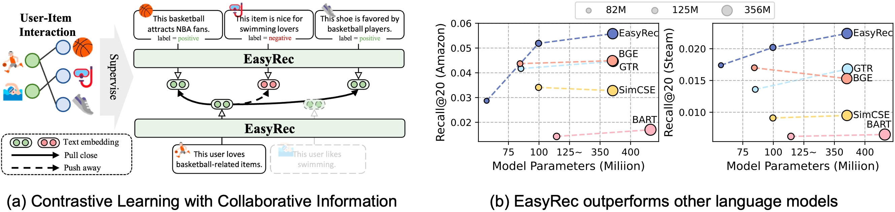

# EasyRec: Simple yet Effective Language Models for Recommendation

This is the PyTorch implementation by <a href='https://github.com/Re-bin'>@Re-bin</a> for EasyRec model proposed in this [paper](https://arxiv.org/abs/2408.08821):

>**EasyRec: Simple yet Effective Language Models for Recommendation**\
>Xubin Ren, Chao Huang*

\* denotes corresponding author

In this paper, we propose an effective language model, *EasyRec*, for recommendation. EasyRec is trained using collaborative information from multiple recommendation datasets, leveraging collaborative user/item profiles as input and employing novel contrastive learning objectives. By encoding user/item profiles into high-quality semantic embeddings suitable for recommendation, EasyRec demonstrates strong performance in text-based zero-shot recommendations and text-enhanced collaborative filtering scenarios.

<p align="center">

</p>

## 📝 Environment
Please run the following  commands to create a conda environment:

```bash
conda create -y -n easyrec python=3.11
pip install torch==2.2.1 torchvision==0.17.1 torchaudio==2.2.1
pip install -U "transformers==4.40.0" --upgrade
pip install accelerate==0.28.0
pip install tqdm
pip install sentencepiece==0.2.0
pip install scipy==1.9.3
pip install setproctitle
pip install sentence_transformers
```

## 🚀 Use EasyRec

### Example Codes
Please first download the codes.
```ssh
git clone https://github.com/HKUDS/EasyRec.git
cd EasyRec
```

Here is an example code snippet to utilize EasyRec for encoding **text embeddings** based on user and item profiles for recommendations.

```Python
import torch
from model import Easyrec
import torch.nn.functional as F
from transformers import AutoConfig, AutoModel, AutoTokenizer

config = AutoConfig.from_pretrained("hkuds/easyrec-roberta-large")
model = Easyrec.from_pretrained("hkuds/easyrec-roberta-large", config=config,)
tokenizer = AutoTokenizer.from_pretrained("hkuds/easyrec-roberta-large", use_fast=False,)

profiles = [
    'This user is a basketball fan and likes to play basketball and watch NBA games.', # user
    'This basketball draws in NBA enthusiasts.', # item 1
    'This item is nice for swimming lovers.'     # item 2
]

inputs = tokenizer(profiles, padding=True, truncation=True, max_length=512, return_tensors="pt")
with torch.inference_mode():
    embeddings = model.encode(input_ids=inputs.input_ids, attention_mask=inputs.attention_mask)
embeddings = F.normalize(embeddings.pooler_output.detach().float(), dim=-1)

print(embeddings[0] @ embeddings[1])    # 0.8576
print(embeddings[0] @ embeddings[2])    # 0.2171
```
### Model List
We release a series of EasyRec checkpoints with varying sizes. You can easily load these models from Hugging Face by replacing the model name.
|              Model              | Model Size | Recall@20 on Amazon-Sports |
|:-------------------------------|:--------:| :--------:|
| [hkuds/easyrec-roberta-small](https://huggingface.co/hkuds/easyrec-roberta-small) |  82M  | 0.0286 |
| [hkuds/easyrec-roberta-base](https://huggingface.co/hkuds/easyrec-roberta-base)   |  125M  | 0.0518  |
| [hkuds/easyrec-roberta-large](https://huggingface.co/hkuds/easyrec-roberta-large) |  355M  | 0.0557  |


## 📚 Datasets with User/Item Profiles (for training and evaluation)

You can download the data by running following commands.
```ssh
wget https://archive.org/download/easyrec_data/data.zip
unzip data.zip
```
You can also download our data from the [[Google Drive](https://drive.google.com/file/d/1fcAb9UwWHXVTLyK3a_MBOGTBqDp64k0P/view?usp=drive_link)]

We utilize six datasets for training (`arts`, `movies`, `games`, `home`, `electronics`, `tools`) and three datasets for testing (`sports`, `steam`, `yelp`). The `steam` and `yelp` datasets are processed in accordance with [previous work (RLMRec)](https://github.com/HKUDS/RLMRec), while the others are derived from the [Amazon Review Data v2](https://cseweb.ucsd.edu/~jmcauley/datasets/amazon_v2/).

For the training datasets, the files in the folder follow this structure:
```
- arts/electronics/games/home/movies/tools:
|--- diverse_profile    # Diversified user/item profiles
|--- prompts            # Prompts to obtain the user/item_profile.json
|--- user_profile.json  # User profiles
|--- item_profile.json  # Item profiles
|--- trn_mat.pkl        # Training Interactions
|--- val_mat.pkl        # Validation Interactions
|--- tst_mat.pkl        # Test Interactions (NOT USED)
```

For the testing datasets, the files in the folder follow this structure:
```
- sports/steam/yelp:
|--- diverse_profile    # Diversified user/item profiles
|--- prompts            # Prompts to obtain the user/item_profile.json (only sports)
|--- user_profile.json  # User profiles
|--- item_profile.json  # Item profiles
|--- trn_mat.pkl        # Training Interactions
|--- val_mat.pkl        # Validation Interactions (NOT USED in text-based recommendation)
|--- tst_mat.pkl        # Test Interactions
```

🤗 In the `prompts` folder (only for the datasets we process here), we profile the input prompt for large language models to obtain the collaborative profiles of users and items. The JSON files also contain the original ID (e.g., ASIN) of users/items in the original dataset. For details of the `steam` and `yelp` datasets, please kindly refer to [RLMRec](https://github.com/HKUDS/RLMRec).

## 🚀 Training
EasyRec follows the same model achitecture of [RoBERTa](https://arxiv.org/abs/1907.11692).

First of all, please download the checkpoint of RoBERTa with the following commands:
```bash
mkdir baseline_embedders
cd baseline_embedders
git clone https://huggingface.co/FacebookAI/roberta-base
git clone https://huggingface.co/FacebookAI/roberta-large
cd ../
```
Then, the command to train different version of EasyRec is as follows:

- EasyRec-Small

    ```bash
    python create_roberta_small.py # create a small version of RoBERTa
    sh train_small.sh
    ```

- EasyRec-Base

    ```bash
    sh train_base.sh
    ```

- EasyRec-Large

    ```bash
    sh train_large.sh
    ```

During training, we utilize multiple GPUs to train EasyRec. You can adjust the number of GPUs in the shell file according to your server configuration. After training, the model parameters will be saved in the `checkpoints` folder.

## 📈 Evaluation

You can directly utilize the provided checkpoints on Hugging Face for evaluation or use the checkpoints obtained after training. Here, we provide example code for utilizing the checkpoints from Hugging Face.

### Text-based Zero-shot Recommendation

To evaluate EasyRec for text-based zero-shot recommendation, we conduct experiments on the `sports`, `steam`, and `yelp` datasets. First, run the following commands to encode the text embeddings for user/item profiles under these three datasets (to utilize the checkpoints obtained from your own training, simply change the argument to `--model ./checkpoints/easyrec-roberta-large`):

```bash
python encode_easyrec.py --model hkuds/easyrec-roberta-large --cuda 0
```

Then, conduct the evaluation (only the model name for the argument `--model` here):

```bash
python eval_text_emb.py --model easyrec-roberta-large --cuda 0
```

Since there are 3 diversified profiles for both user and item in each dataset, we perform the evaluation 1+3 times with the corresponding text embeddings and calculate the mean value as the final result.

### Text-enhanced Collaborative Filtering

We conduct evaluation on text-enhanced collaborative filtering performance on the `steam` dataset. To evaluate EasyRec, please ensure that you have already encoded text embeddings for the `steam` dataset with the command:

```bash
python encode_easyrec.py --model hkuds/easyrec-roberta-large --cuda 0
```

Then, navigate to the `cf_rec` folder by running `cd cf_rec`. After that, execute the following commands to evaluate:

- Base model

    ```bash
    python run.py --model {model_name} --dataset steam --cuda 0
    ```

- Text-enhanced model

    ```bash
    python run.py --model {model_name}_plus --semantic easyrec-roberta-large --dataset steam --cuda 0
    ```

**Supported Models:** `gccf` and `lightgcn`.

## 🔮 Profile Generation and Diversification
Here we provide some examples with *Amazon-Arts* Data to conduct user/item profile generation and diversification.

Firstly, we need to complete the following three steps.
- Install the openai library `pip install openai`
- Prepare your **OpenAI API Key**
- Enter your key on `Line 5` of these files: `generation/generate_profile.py` and `generation/diverse_profile.py`.

Then, here are the commands to generate the desired output with examples:

  - **Profile Generation**:

    ```python generation/generate_profile.py```

  - **Profile Diversification**:

    ```python generation/diverse_profile.py```

😀 The **instructions** we designed are saved in the `generation/instruction` folder. You can modify them according to your requirements and generate the desired output!

## 🌟 Citation
If you find this work is helpful to your research, please consider citing our paper:
```bibtex
@article{ren2024easyrec,
  title={EasyRec: Simple yet Effective Language Models for Recommendation},
  author={Ren, Xubin and Huang, Chao},
  journal={arXiv preprint arXiv:2408.08821},
  year={2024}
}
```

**Thanks for your interest in our work!**
